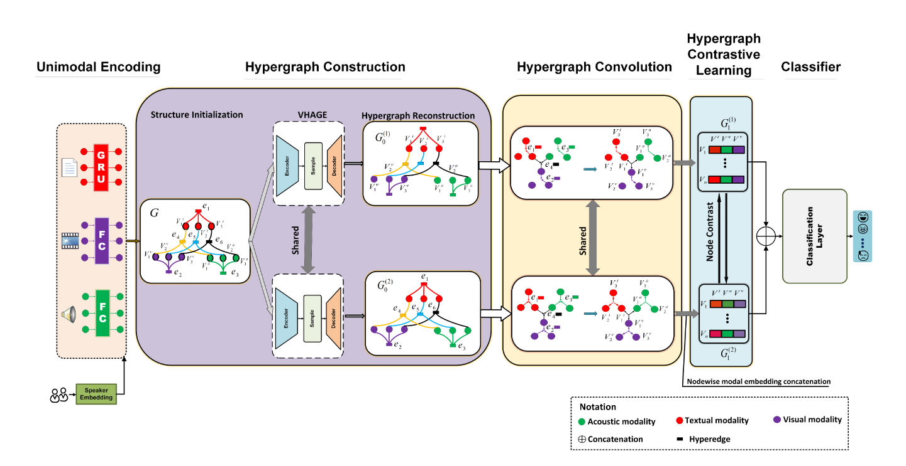
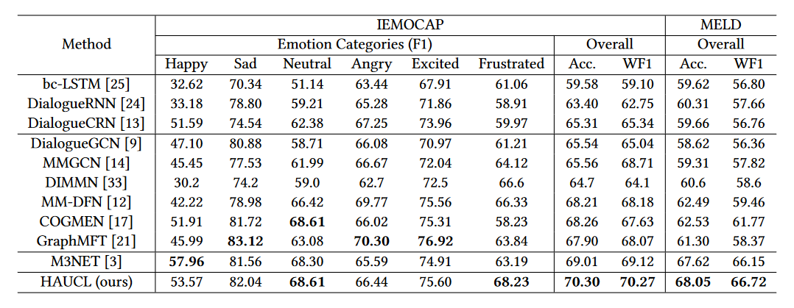

### Multimodal Fusion via Hypergraph Autoencoder and Contrastive Learning for Emotion Recognition in Conversation

Our paper has been accpeted by ACM Multimedia 2024, please refer to [Arxiv](https://arxiv.org/pdf/2408.00970) for the latest version.


### Requirements

- Python 3.10
- Pytorch 2.1.2
- CUDA 11.8
- PyG 2.4.0
- torch-scatter: 2.1.2
- torch-sparse: 0.6.18

### Dataset
The raw data can be found at [IEMOCAP](https://sail.usc.edu/iemocap/ "IEMOCAP") and [MELD](https://github.com/SenticNet/MELD "MELD"). We use pre-extracted features from [M3NET](https://openaccess.thecvf.com/content/CVPR2023/html/Chen_Multivariate_Multi-Frequency_and_Multimodal_Rethinking_Graph_Neural_Networks_for_Emotion_CVPR_2023_paper.html), please refer to the [Dataset](https://github.com/feiyuchen7/M3NET?tab=readme-ov-file) after preprocessing.

### Run the model
Maintain a directory structure with datasets placed as follows:
```
├── Dataset
│   ├── Meld_features
│   └── IEMOCAP_features
├── src
│   ├── train_haucl.py
│   └── Other code scripts
├── logs
└── Readme.md
```

Use default setting (tuned to best reported result) to run the HAUCL Model
```
python src/train_haucl.py
```

The settings are pretty complicated so please refer to the help script for more details

```
python src/train_haucl.py --help
```

### Evaluation Result


